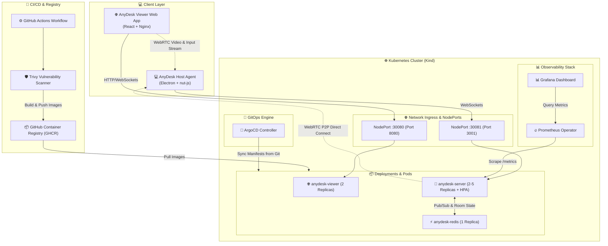
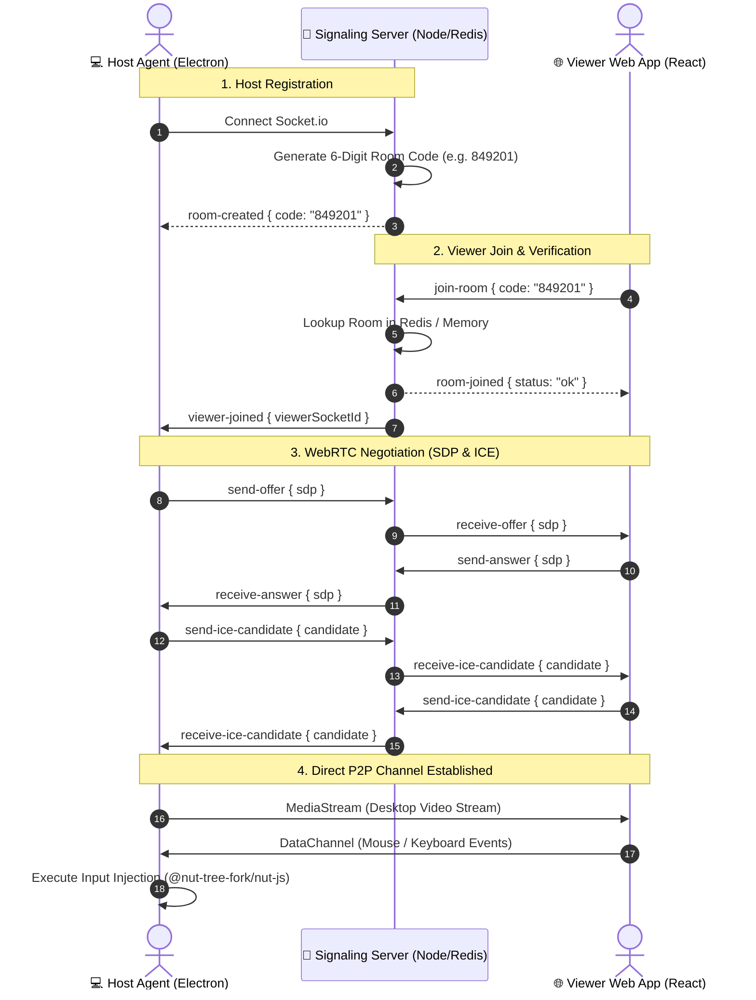

# 💻 AnyDesk Clone — Cloud-Native Remote Desktop Platform & DevOps Infrastructure

A modern, high-performance, web-based remote desktop application built with **WebRTC**, **React**, **Electron**, and **Node.js**, backed by an **Enterprise-Grade DevOps Pipeline** featuring **Docker**, **Kubernetes (Kind)**, **ArgoCD (GitOps)**, **GitHub Actions (CI/CD)**, **Trivy Vulnerability Scanning**, **Redis Pub/Sub**, and **Prometheus/Grafana Observability**.

---

## 📐 High-Level System Architecture

The following diagram illustrates the complete end-to-end architecture, including the application components, containerized services, Kubernetes cluster, GitOps pipeline, and monitoring stack.



---

## 🔄 WebRTC Signaling & Connection Sequence

The signaling server acts as a matchmaker to negotiate a direct peer-to-peer connection between the Viewer and Host using WebRTC.



---

## 🏗️ Project Structure & Component Breakdown

```text
AnyDesk/
├── start.bat                         # Local Windows development launcher
├── kind-config.yaml                  # Kind cluster configuration with port mappings
├── argocd-app.yaml                   # ArgoCD Application GitOps manifest
├── devops-playbook.md                # Step-by-step DevOps operational guide
├── docker-compose.yml                # Multi-container local orchestration
├── .github/
│   └── workflows/
│       └── ci.yml                    # Automated GitHub Actions CI/CD pipeline
│
├── k8s/                              # Kubernetes Manifests
│   ├── server-deployment.yaml        # Server Deployment (HPA + Probes + Secrets)
│   ├── server-service.yaml           # Server NodePort Service (Port 30081)
│   ├── server-hpa.yaml               # Server Horizontal Pod Autoscaler (Min 2, Max 5)
│   ├── client-deployment.yaml        # Viewer Deployment
│   ├── client-service.yaml           # Viewer NodePort Service (Port 30080)
│   ├── client-hpa.yaml               # Viewer Horizontal Pod Autoscaler
│   ├── redis-deployment.yaml         # Redis Deployment
│   ├── redis-service.yaml            # Redis Service (ClusterIP)
│   ├── grafana-dashboard.json        # Grafana Dashboard Export
│   └── grafana-dashboard-configmap.yaml # Grafana Dashboard Auto-Import ConfigMap
│
├── anydesk-server/                   # 🧠 Signaling Server (Node.js + Express + Socket.io)
│   ├── Dockerfile                    # Multi-stage production build (Node 20 Alpine)
│   └── src/
│       ├── index.ts                  # Server setup, Socket.io Redis adapter, /metrics
│       ├── services/
│       │   ├── redisClient.ts        # Hybrid Redis client with graceful in-memory fallback
│       │   └── roomService.ts        # Room state management (Redis + Memory fallback)
│       └── utils/
│
├── anydesk-viewer/                   # 🌐 Controller Web App (React + Vite + TailwindCSS)
│   ├── Dockerfile                    # Multi-stage build (Vite build -> Nginx Alpine)
│   └── src/
│
└── anydesk-host/                     # 💻 Target Host Agent (Electron + nut-js)
    └── src/
```

---

## 🛠️ DevOps & Infrastructure Architecture

### Phase 1: Containerization & Orchestration
- **Production Dockerfiles**: Multi-stage Docker builds configured for minimum image footprint.
  - `anydesk-server`: Compiles TypeScript in Stage 1, strips `devDependencies` with `npm ci --omit=dev` in Stage 2 to minimize CVE exposure.
  - `anydesk-viewer`: Compiles Vite static assets in Stage 1 and serves via Nginx Alpine in Stage 2.
- **Docker Compose**: Orchestrates local execution of Server, Viewer, and Redis with health check dependencies (`depends_on: condition: service_healthy`).

### Phase 2: Automated CI/CD & Security Scanning
- **GitHub Actions (`ci.yml`)**: Automated pipeline triggered on pushes to `main`.
- **Trivy Vulnerability Scanner (`aquasecurity/trivy-action`)**: Scans built images for OS and library CVEs before pushing.
- **Container Registry**: Publishes scanned images to GitHub Container Registry (`ghcr.io/gaurravvvv/anydesk-server` & `anydesk-viewer`).

### Phase 3: Kubernetes Cluster & GitOps (Kind + ArgoCD)
- **Local Kubernetes Cluster (`kind-config.yaml`)**: Runs a `kind` cluster with extra port mappings:
  - Host Port `8080` -> NodePort `30080` (Viewer Web App)
  - Host Port `3001` -> NodePort `30081` (Signaling Server)
- **GitOps Continuous Deployment (ArgoCD)**: `argocd-app.yaml` monitors the `k8s/` directory in GitHub and automatically syncs all changes directly into the cluster.

### Phase 4: Hybrid State & Fault Tolerance
- **Stateless Server Architecture**: Node.js signaling servers use `@socket.io/redis-adapter` for cross-pod WebRTC message broadcasting.
- **Resilient Fallback**: `redisClient.ts` automatically attempts a Redis connection. If running in a single-instance environment without Redis (e.g. Render free tier), it logs a warning and gracefully falls back to in-memory `Map` stores without crashing.

### Phase 5 & 6: Observability & Chaos Engineering
- **Metrics Instrumentation**: Server exposes Prometheus metrics at `/metrics` using `prom-client` (CPU %, Heap Memory, Event Loop Lag).
- **Monitoring Stack**: Deployed `kube-prometheus-stack` via Helm containing Prometheus Operator and Grafana.
- **Auto-Registering Dashboards**: `grafana-dashboard-configmap.yaml` automatically registers the **AnyDesk Cluster & Server Observability** dashboard into Grafana.
- **Autoscaling & Resilience**:
  - **Self-Healing**: Killing any pod (`kubectl delete pod`) causes Kubernetes to recreate a healthy pod in seconds.
  - **HPA Scaling**: High CPU load triggers the Horizontal Pod Autoscaler to scale server replicas from 2 up to 5 pods.

---

## 🚀 How to Run the Project

### Option 1: Native Local Development (Windows)
Run the automated batch script to launch Server, Viewer, and Host Agent simultaneously:
```powershell
.\start.bat
```

### Option 2: Local Docker Compose Stack
Spin up the entire containerized architecture locally:
```powershell
docker-compose up --build
```
- **Viewer**: `http://localhost:8080`
- **Server**: `http://localhost:3001`

### Option 3: Local Kubernetes Cluster with ArgoCD (GitOps)
Follow the complete deployment steps using the isolated CLI tools:

1. **Create the Kind Cluster:**
   ```powershell
   .\.bin\kind create cluster --config kind-config.yaml --name anydesk
   ```

2. **Add GitHub Registry Secret:**
   ```powershell
   .\.bin\kubectl create secret docker-registry ghcr-secret --docker-server=ghcr.io --docker-username=Gaurravvvv --docker-password=<YOUR_GITHUB_TOKEN>
   ```

3. **Install ArgoCD:**
   ```powershell
   .\.bin\kubectl create namespace argocd
   .\.bin\kubectl apply -n argocd -f https://raw.githubusercontent.com/argoproj/argo-cd/stable/manifests/install.yaml
   ```

4. **Deploy Application via GitOps:**
   ```powershell
   .\.bin\kubectl apply -f argocd-app.yaml
   ```

5. **Install Monitoring (Prometheus & Grafana via Helm):**
   ```powershell
   .\.bin\helm repo add prometheus-community https://prometheus-community.github.io/helm-charts
   .\.bin\helm repo update
   .\.bin\helm install monitoring prometheus-community/kube-prometheus-stack --namespace monitoring --create-namespace
   .\.bin\kubectl apply -f k8s/grafana-dashboard-configmap.yaml
   ```

6. **Access Grafana Dashboard:**
   ```powershell
   .\.bin\kubectl port-forward svc/monitoring-grafana 8081:80 -n monitoring
   ```
   - URL: `http://localhost:8081`
   - User: `admin` | Password: `prom-operator`

---

## 📜 Operational Playbook

For deep troubleshooting steps, rate limit mitigations, and self-healing verification tests, reference the **[`devops-playbook.md`](file:///c:/Users/VICTUS/OneDrive/Desktop/Internship/Personal\AnyDesk\devops-playbook.md)**.
